```r
library(ggplot2)
library(GGally)
library(randomForest)
library(mice)
library(dplyr)

train<-read.csv("train.csv")
test<-read.csv("test.csv")
test$Survived<-NA
```

Combine training and test set, add features and look at missing data

```r
all<-rbind(train,test)

# creating a feature with the total number of passengers in a family
all$FamSize<-all$SibSp+all$Parch+1


# creating a title/suffix feature from the name list
all$Title<-gsub("(\\..*)|(.*,)","",all$Name)

all<-all %>% mutate_if(is.character, as.factor)

# replace missing data with NA
all<-data.frame(apply(all,2,function(x) gsub("^$",NA,x)))

all[,c("SibSp","Parch","Age","Fare","FamSize")]<-apply(all[c("SibSp","Parch","Age","Fare","FamSize")],2,function(x) as.numeric(x))

# look at missing data
md.pattern(all)
```

```
##     PassengerId Pclass Name Sex SibSp Parch Ticket FamSize Title Fare
## 183           1      1    1   1     1     1      1       1     1    1
##  87           1      1    1   1     1     1      1       1     1    1
##  19           1      1    1   1     1     1      1       1     1    1
## 529           1      1    1   1     1     1      1       1     1    1
##   2           1      1    1   1     1     1      1       1     1    1
##   4           1      1    1   1     1     1      1       1     1    1
## 244           1      1    1   1     1     1      1       1     1    1
## 158           1      1    1   1     1     1      1       1     1    1
##  82           1      1    1   1     1     1      1       1     1    1
##   1           1      1    1   1     1     1      1       1     1    0
##               0      0    0   0     0     0      0       0     0    1
##     Embarked Age Survived Cabin     
## 183        1   1        1     1    0
##  87        1   1        0     1    1
##  19        1   0        1     1    1
## 529        1   1        1     0    1
##   2        0   1        1     1    1
##   4        1   0        0     1    2
## 244        1   1        0     0    2
## 158        1   0        1     0    2
##  82        1   0        0     0    3
##   1        1   1        0     0    3
##            2 263      418  1014 1698
```
Maybe we can do something with the last name, but I'll stick with just the family size 
263 missing values in Age, 2 missing values in Embarked, 1 missing value in Fare, 1014 missing values in Cabin
77% missing data for cabin  (will try the model with and without cabin later)

imputing missing data using mice


```r
imputed_all <- mice(all[,colnames(all)%in%c("Pclass","Sex","SibSp","Parch","Fare","Age","Embarked","title")], m=1, seed = 131)
```

```
## 
##  iter imp variable
##   1   1  Age  Fare  Embarked
##   2   1  Age  Fare  Embarked
##   3   1  Age  Fare  Embarked
##   4   1  Age  Fare  Embarked
##   5   1  Age  Fare  Embarked
```

```r
imputed_all<- complete(imputed_all)
```

just want to check the imputed missing data to see if I should just keep the ones from mice package.

```r
# Age
ggplot()+geom_histogram(data=all,aes(x=Age),bins=50)+theme_bw()
```

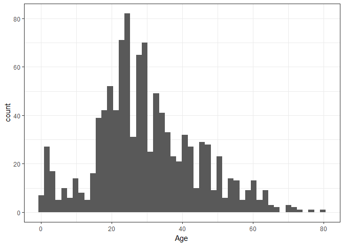<!-- -->

```r
ggplot()+geom_histogram(data=imputed_all,aes(x=Age),bins=50)+theme_bw()
```

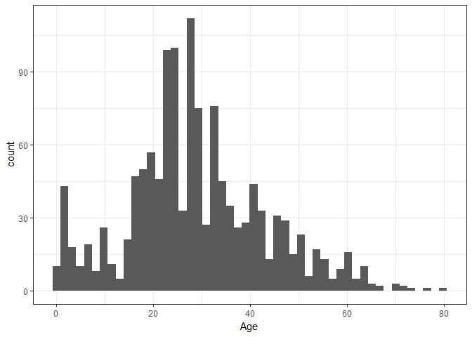<!-- -->

```r
all$Age<-imputed_all$Age

# Fare
imputed_all[is.na(all$Fare),]
```

```
##      Pclass  Sex  Age SibSp Parch Fare Embarked
## 1044      3 male 60.5     0     0 7.75        S
```

```r
all[is.na(all$Fare),]
```

```
##      PassengerId Survived Pclass               Name  Sex  Age SibSp Parch
## 1044        1044     <NA>      3 Storey, Mr. Thomas male 60.5     0     0
##      Ticket Fare Cabin Embarked FamSize Title
## 1044   3701   NA  <NA>        S       1    Mr
```

```r
# it is replaced with 7.75
C3ES<-train[(train$Pclass=="3") & (train$Embarked=="S"),]

ggplot()+geom_histogram(data=C3ES,aes(x=Fare),bins=100)+theme_bw()
```

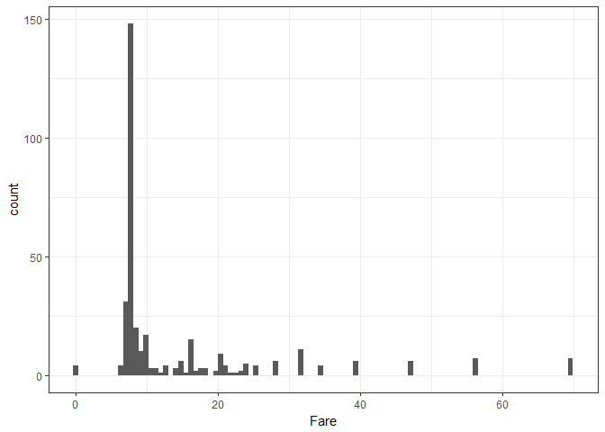<!-- -->

```r
median(C3ES$Fare)
```

```
## [1] 8.05
```

```r
names(sort(-table(C3ES$Fare)))[1]
```

```
## [1] "8.05"
```

```r
# it seems more reasonable with 8.05 based on the plot. So I'll reassign that
all[which(is.na(all$Fare)),]$Fare<-as.numeric("8.05")


# embarkation
imputed_all[is.na(all$Embarked),]
```

```
##     Pclass    Sex Age SibSp Parch Fare Embarked
## 62       1 female  38     0     0   80        S
## 830      1 female  62     0     0   80        C
```

```r
all[is.na(all$Embarked),]
```

```
##     PassengerId Survived Pclass                                      Name
## 62           62        1      1                       Icard, Miss. Amelie
## 830         830        1      1 Stone, Mrs. George Nelson (Martha Evelyn)
##        Sex Age SibSp Parch Ticket Fare Cabin Embarked FamSize Title
## 62  female  38     0     0 113572   80   B28     <NA>       1  Miss
## 830 female  62     0     0 113572   80   B28     <NA>       1   Mrs
```
Passenger 62 and 830 have the same ticket number, but the imputed embarkation is at different places (S and C, respectively)

They were in the first class, paid 80 for the ticket each. We could impute it based on the most frequent embarkation or based on the fare they paid in the first class.

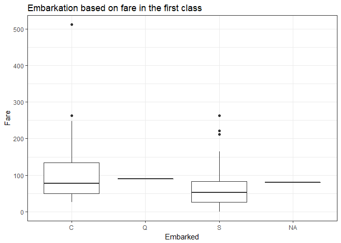<!-- -->

```
##    
##       1   2   3
##   C 141  28 101
##   Q   3   7 113
##   S 177 242 495
```

It seems like the missing embarkations are more likely to be C based on the fare in first class (Q the least frequent). 
p/s: Apparently, the information is available online, the two of them embarked at Southampton.I would have actually gone with C instead. I'll just do it and see how that performs. 

```r
all[which(is.na(all$Embarked)),]$Embarked<-"C"
```

Many missing values in Cabin.
I will just ignore the cabin number and go with the deck (level), Fill in the missing cabin values with NC (no cabin)

```r
all$Cabin2<-gsub("[0-9].*","",all$Cabin)
all[is.na(all$Cabin2),]$Cabin2<-"NC"
table(all$Cabin2,all$Survived)
```

```
##      
##         0   1
##   A     8   7
##   B    12  35
##   C    24  35
##   D     8  25
##   E     8  24
##   F     2   7
##   F E   0   1
##   F G   3   0
##   G     2   2
##   NC  481 206
##   T     1   0
```

```r
all[all$Cabin2=="F E",]$Cabin2<-as.character("E")
all[all$Cabin2=="F G",]$Cabin2<-as.character("G")
all<-all %>% mutate_if(is.character, as.factor)
```

making sure no more missing data (not gonna use the Cabin column) 

```r
md.pattern(all[,-which(names(all) %in% "Cabin")])
```

```
##     PassengerId Pclass Name Sex Age SibSp Parch Ticket Fare Embarked
## 891           1      1    1   1   1     1     1      1    1        1
## 418           1      1    1   1   1     1     1      1    1        1
##               0      0    0   0   0     0     0      0    0        0
##     FamSize Title Cabin2 Survived    
## 891       1     1      1        1   0
## 418       1     1      1        0   1
##           0     0      0      418 418
```

Exploring the data

```r
all$AgeGroup<-findInterval(all$Age,c(10,20,30,40,50,60))
ggplot()+geom_bar(data=all[1:891,],aes(x=AgeGroup,fill=factor(Survived)),position="fill")+theme_bw()+ggtitle("Survival and Age")
```

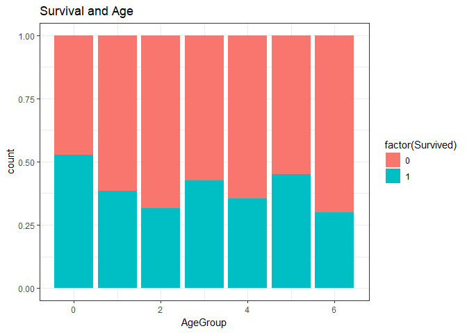<!-- -->

Passengers in the 20s and over 60s are most likely to not surive. Children < 10 survived the most. 


```r
ggplot()+geom_bar(data=all[1:891,],aes(x=Pclass,fill=factor(Survived)),position="fill")+theme_bw()+ggtitle("Survival and Pclass")
```

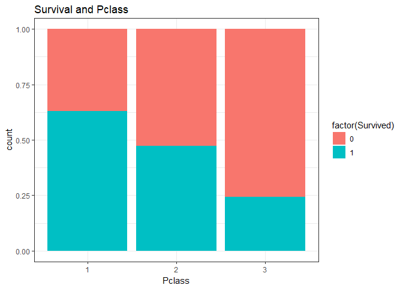<!-- -->

Pclass 1 is most likely to survive


```r
ggplot()+geom_bar(data=all[1:891,],aes(x=Sex,fill=factor(Survived)),position="fill")+theme_bw()+ggtitle("Survival and Sex")
```

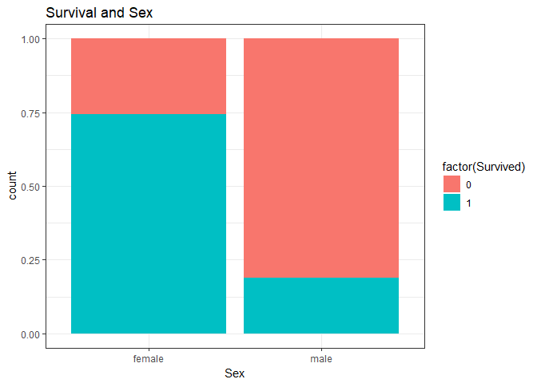<!-- -->

Female is more likely to survive


```r
ggplot()+geom_bar(data=all[1:891,],aes(x=SibSp,fill=factor(Survived)),position="fill")+theme_bw()+ggtitle("Survival and Number of sibling and spouses onboard")
```

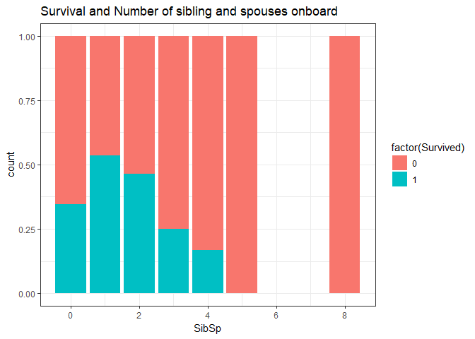<!-- -->

```r
ggplot()+geom_bar(data=all[1:891,],aes(x=Parch,fill=factor(Survived)),position="fill")+theme_bw()+ggtitle("Survival and Number of parents and children onboard")
```

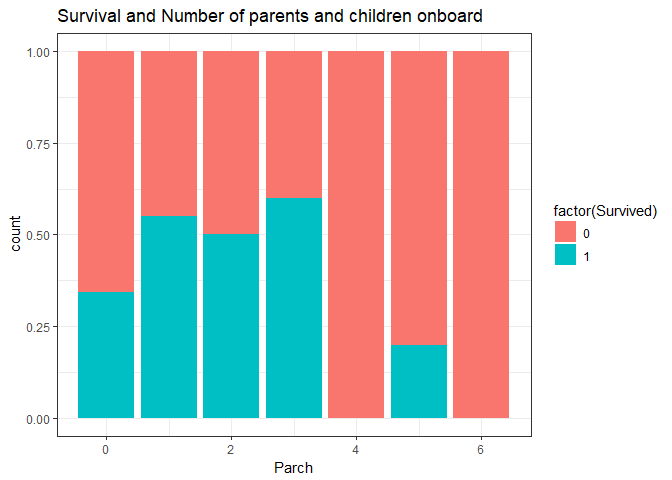<!-- -->

```r
ggplot()+geom_bar(data=all[1:891,],aes(x=FamSize,fill=factor(Survived)),position="fill")+theme_bw()+ggtitle("Survival and total number of family")
```

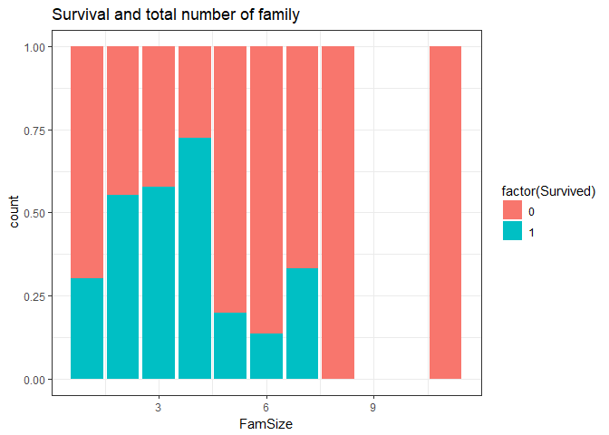<!-- -->

Middle size family seems to be most likely to survive.


```r
ggplot()+geom_boxplot(data=all[1:891,],aes(y=Fare,x=factor(Survived)))+theme_bw()+ggtitle("Survival and Fare")
```

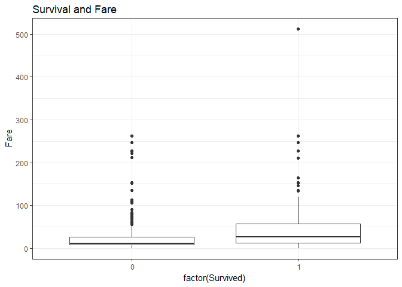<!-- -->

The higher the fare one paid, the more likely he/she survived. 


```r
ggplot()+geom_bar(data=all[1:891,],aes(x=Cabin2,fill=factor(Survived)),position="fill")+theme_bw()+ggtitle("Survival and cabin")
```

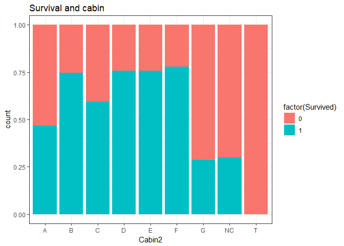<!-- -->

I was expecting more survival from cabin A, but we can see that G has very low survival rate. I will try the model with or without cabin level.


```r
ggplot()+geom_bar(data=all[1:891,],aes(x=Embarked,fill=factor(Survived)),position="fill")+theme_bw()+ggtitle("Survival and Embarkation")
```

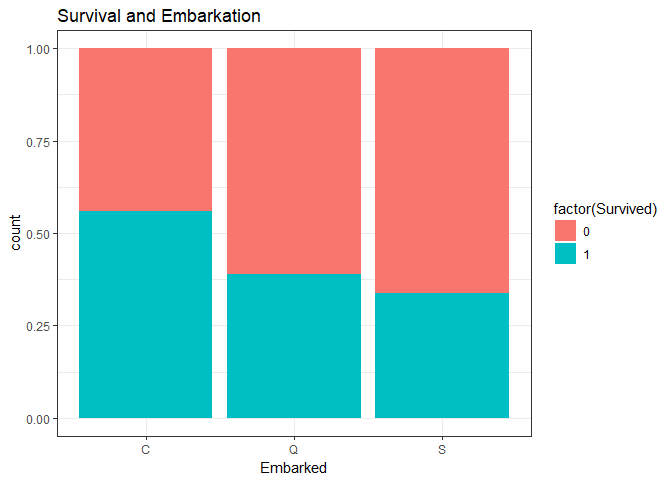<!-- -->


```r
# include cabin level, and numerical age
set.seed(131)
titanic1.rf<-randomForest(factor(Survived)~Pclass+Sex+Age+SibSp+Parch+Fare+Cabin2+FamSize+Title+Embarked,data=all[1:891,])

varImpPlot(titanic1.rf)
```

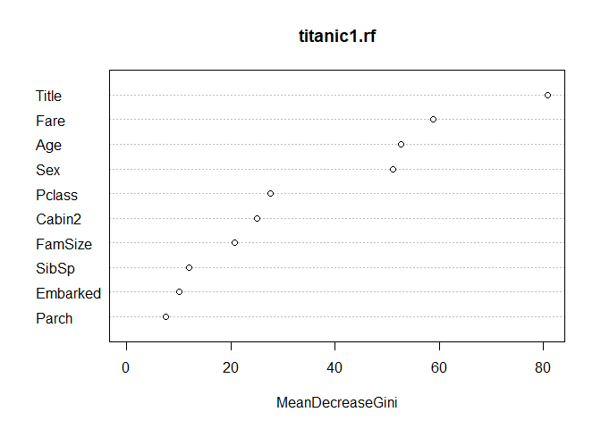<!-- -->

```r
print(titanic1.rf) 
```

```
## 
## Call:
##  randomForest(formula = factor(Survived) ~ Pclass + Sex + Age +      SibSp + Parch + Fare + Cabin2 + FamSize + Title + Embarked,      data = all[1:891, ]) 
##                Type of random forest: classification
##                      Number of trees: 500
## No. of variables tried at each split: 3
## 
##         OOB estimate of  error rate: 16.72%
## Confusion matrix:
##      0   1 class.error
##  0 489  60   0.1092896
##  1  89 253   0.2602339
```


```r
# include cabin level, and Age GROUP
set.seed(131)
titanic2.rf<-randomForest(factor(Survived)~Pclass+Sex+AgeGroup+SibSp+Parch+Fare+Cabin2+FamSize+Title+Embarked,data=all[1:891,])
varImpPlot(titanic2.rf)
```

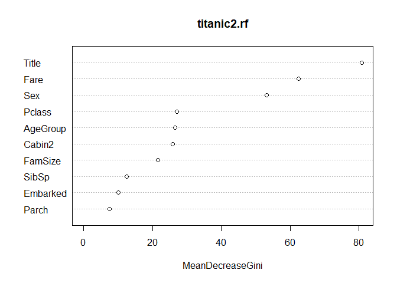<!-- -->

```r
print(titanic2.rf) 
```

```
## 
## Call:
##  randomForest(formula = factor(Survived) ~ Pclass + Sex + AgeGroup +      SibSp + Parch + Fare + Cabin2 + FamSize + Title + Embarked,      data = all[1:891, ]) 
##                Type of random forest: classification
##                      Number of trees: 500
## No. of variables tried at each split: 3
## 
##         OOB estimate of  error rate: 17.06%
## Confusion matrix:
##      0   1 class.error
##  0 489  60   0.1092896
##  1  92 250   0.2690058
```

Did worse by grouping age

```r
# Exclude cabin level, and include numerical age
set.seed(131)
titanic3.rf<-randomForest(factor(Survived)~Pclass+Sex+Age+SibSp+Parch+Fare+FamSize+Title+Embarked,data=all[1:891,])
varImpPlot(titanic3.rf)
```

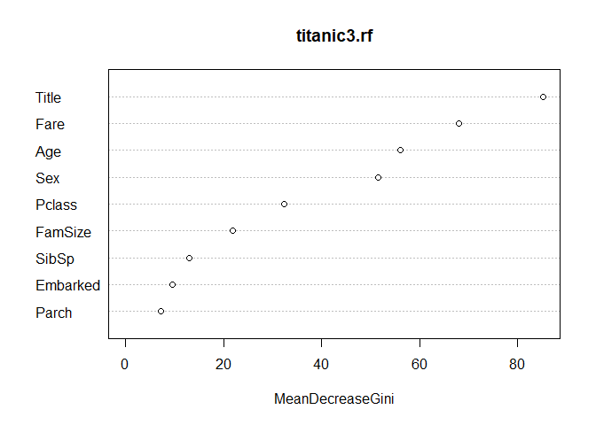<!-- -->

```r
print(titanic3.rf) 
```

```
## 
## Call:
##  randomForest(formula = factor(Survived) ~ Pclass + Sex + Age +      SibSp + Parch + Fare + FamSize + Title + Embarked, data = all[1:891,      ]) 
##                Type of random forest: classification
##                      Number of trees: 500
## No. of variables tried at each split: 3
## 
##         OOB estimate of  error rate: 17.51%
## Confusion matrix:
##      0   1 class.error
##  0 488  61   0.1111111
##  1  95 247   0.2777778
```
 worse without cabin!
 
 

```r
# Exclude cabin level, and include age group
set.seed(131)
titanic4.rf<-randomForest(factor(Survived)~Pclass+Sex+AgeGroup+SibSp+Parch+Fare+FamSize+Title+Embarked,data=all[1:891,])
varImpPlot(titanic4.rf)
```

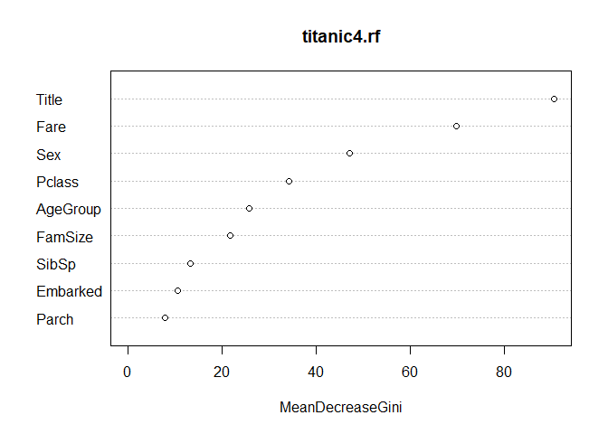<!-- -->

```r
print(titanic4.rf) 
```

```
## 
## Call:
##  randomForest(formula = factor(Survived) ~ Pclass + Sex + AgeGroup +      SibSp + Parch + Fare + FamSize + Title + Embarked, data = all[1:891,      ]) 
##                Type of random forest: classification
##                      Number of trees: 500
## No. of variables tried at each split: 3
## 
##         OOB estimate of  error rate: 16.72%
## Confusion matrix:
##      0   1 class.error
##  0 493  56   0.1020036
##  1  93 249   0.2719298
```
Comparable to the first one, better in predicting death (titanic1 is better in predicting survival)

I'll stick to the first one

```r
pred<-predict(titanic1.rf,newdata=all[892:1309,])

dat<-data.frame(PassengerId=all[892:1309,]$PassengerId,Survived=pred)
write.csv(dat,file="titanic_survival.csv",row.names = F)
```

Submitted, got a score of 0.76076
